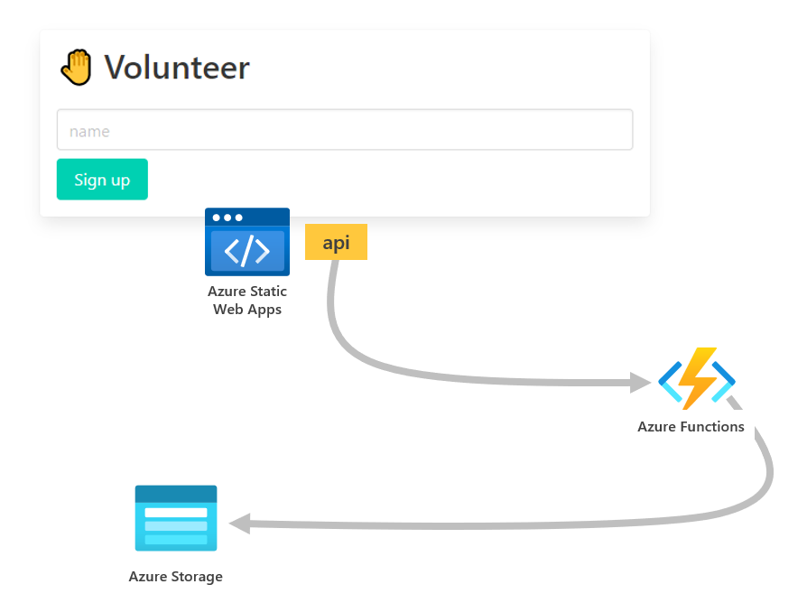

# Azure Static Web Apps with Custom Functions

Take advantage of the flexibility of Azure Functions and leverage the ease-of-use of Azure Static Web Apps.

This demo app shows how to link an Azure Static Web App to an existing Azure Functions app. To run the application, you need to run the [API app](https://github.com/craigshoemaker/static-web-apps-custom-functions-api) before attempting the below steps to run this front-end application.

## Background

Azure Static Web Apps defaults to a managed Azure Functions app as the API for the website. [Managed Functions don't support all the triggers](https://docs.microsoft.com/azure/static-web-apps/apis) that a typical Functions app does. 

This sample application shows how to link an Azure Static Web Apps site to an existing Azure Functions application, which is supports all triggers, bindings, and features of Azure Functions.

## How it works

By [linking an existing Azure Functions app](https://docs.microsoft.com/azure/static-web-apps/functions-bring-your-own#link-an-existing-azure-functions-app) to your Azure Static Web Apps site, the `api` route resolves to the custom functions app.

## Prerequisites

- [Azure Static Web Apps CLI](https://github.com/Azure/static-web-apps-cli)
- [Azure Static Web Apps VS Code extension](https://marketplace.visualstudio.com/items?itemName=ms-azuretools.vscode-azurestaticwebapps)
- [Sample API project](https://github.com/craigshoemaker/static-web-apps-custom-functions-api)

## Get started

First, follow the steps to run the [API project in a debugging session](https://github.com/craigshoemaker/static-web-apps-custom-functions-api).

1. Clone the repository:

    `git clone https://github.com/craigshoemaker/static-web-apps-custom-functions`

1. Change folders:

    `cd static-web-apps-custom-functions`

1. Install dependencies:

    `npm install`

1. Install Static Web Apps CLI:

    `npm install -g @azure/static-web-apps-cli`

1. Start the app:

    `swa start --api=http://localhost:7071`